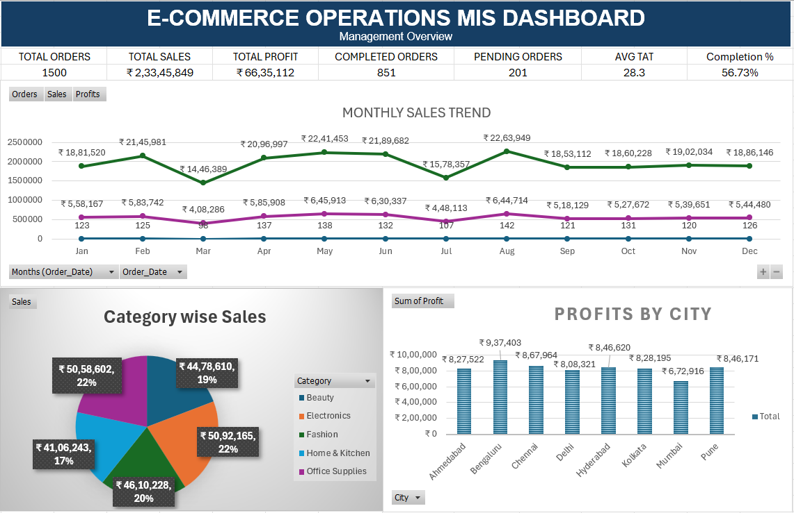

# E-Commerce Operations MIS Dashboard

<p align="center">
  
</p>

## 📌 Project Overview

The E-Commerce Operations MIS Dashboard is an Excel-based business reporting solution designed to monitor and analyze operational performance. This project transforms raw e-commerce data into meaningful insights through interactive visualizations and KPI tracking. The dashboard provides a comprehensive view of sales, profit, orders, and fulfillment performance, enabling better decision-making. It helps identify sales trends, profitable locations, and top-performing product categories. Monthly analysis allows users to track business growth and performance fluctuations throughout the year. The dashboard is built using Excel tools such as Pivot Tables, Pivot Charts, and Slicers to create a user-friendly reporting experience. By converting raw data into actionable insights, the project demonstrates practical MIS reporting and business analysis skills. It serves as a valuable tool for managers and analysts to monitor business performance efficiently.

🔹 Key Features
- KPI tracking for Sales, Profit, Orders, Completion Rate, and Average TAT.
- Monthly analysis of Sales, Profit, and Order trends.
- Category-wise sales performance comparison.
- City-wise profit analysis to identify top-performing locations.

---

## 🎯 Objectives

- Monitor overall business performance.
- Track sales and profit trends.
- Analyze order completion status.
- Evaluate category-wise sales contribution.
- Compare profit performance across cities.

---

## 🛠 Tools Used

- Microsoft Excel
- Pivot Tables
- Pivot Charts
- Slicers
- KPI Cards

---

## 📊 Key Metrics

| Metric | Value |
|----------|----------|
| Total Orders | 1,500 |
| Total Sales | ₹2.33 Cr |
| Total Profit | ₹66.35 L |
| Completed Orders | 851 |
| Pending Orders | 201 |
| Average TAT | 28.3 |
| Completion Rate | 56.73% |

---

## 📈 Dashboard Highlights

### Monthly Performance
- Highest Sales: **August (₹22.64 L)**
- Lowest Sales: **March (₹14.46 L)**
- Sales and profit trends remain largely aligned throughout the year.

### Category Analysis
- Top Categories: **Electronics** and **Office Supplies**
- Lowest Contribution: **Home & Kitchen**

### City-wise Profitability
- Highest Profit: **Bengaluru**
- Lowest Profit: **Mumbai**

---

## 🔍 Key Insights

- Generated over **₹2.33 Crore** in total sales.
- Achieved **₹66.35 Lakh** in profit.
- More than half of all orders were successfully completed.
- Electronics category emerged as a major revenue contributor.
- Bengaluru delivered the strongest profit performance among all cities.

---

## 📂 Repository Contents

```text
📁 E-Commerce-Operations-MIS-Dashboard
│
├── MIS Project.xlsx
├── Excel_Raw_Data.csv
├── Dashboard.png
└── README.md
```

---

## 🚀 Skills Demonstrated

- **Data Cleaning & Preparation** – Cleaned, organized, and transformed raw data to ensure accuracy and consistency for analysis.
- **MIS Reporting** – Created structured reports to track business performance and support management decision-making.
- **KPI Analysis & Tracking** – Monitored key metrics including Sales, Profit, Orders, Completion Rate, and Average TAT.
- **Data Visualization** – Designed interactive charts and KPI cards to present insights in a clear and visually appealing format.
- **Dashboard Development** – Built an interactive Excel dashboard for monitoring operational and financial performance.
- **Business Analysis** – Analyzed sales trends, profitability, category performance, and city-wise business results.
- **Pivot Tables & Pivot Charts** – Utilized Excel's analytical tools to summarize, analyze, and visualize large datasets efficiently.
- **Trend Analysis** – Identified monthly performance patterns, growth opportunities, and business trends.
- **Excel Analytics** – Applied advanced Excel features including Pivot Tables, Charts, Slicers, Conditional Formatting, and Formulas.
- **Decision Support Reporting** – Converted raw business data into actionable insights to support strategic business decisions.

---

## 👨‍💻 Author

**Shaik Sirajuddin**

Aspiring Data Analyst | MIS Executive | Excel Enthusiast

---

⭐ If you found this project helpful, consider giving it a star.
